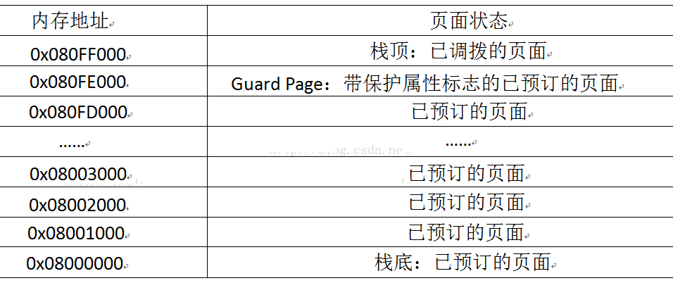
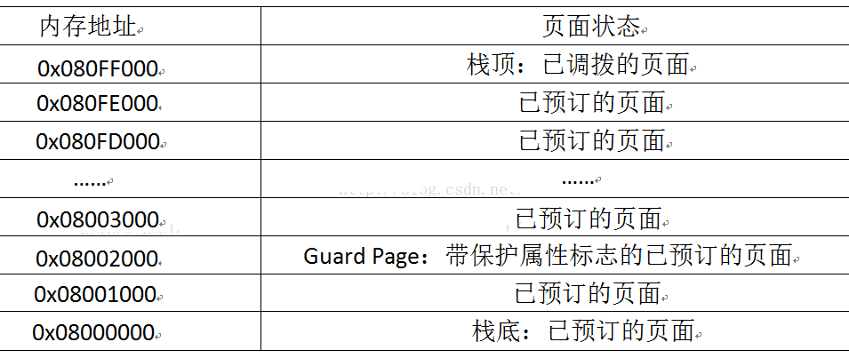
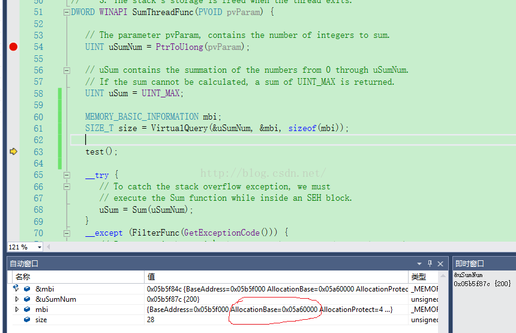
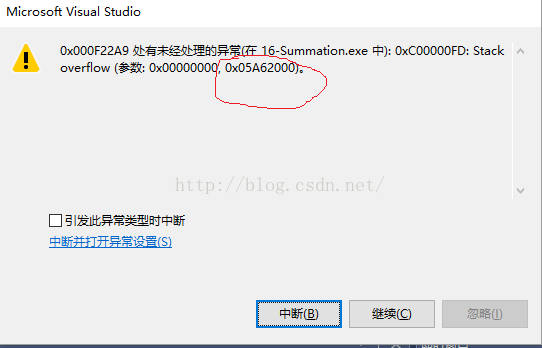

来源： http://blog.csdn.net/sagittarius_warrior/article/details/52035822

**线程栈（Thread  Stack）**是**用来存放线程执行时所需要的所有函数参数和局部变量的栈空间**。

当系统创建线程时，会为线程栈**预订（reserve）一块地址空间区域（region）**，并给区**域调拨（commit）一些物理存储器**。

需要注意的是，**这个地址空间区域（线程栈）是在进程地址空间的用户分区中，而不是内核分区中**。

**默认情况下，系统会预订“1MB”的地址空间并调拨两个页面的存储器。**

可以通过修改**编译器（/F选项）**和**链接器（/STACK选项）**的编译选项来修改的。

另外，在创建线程**CreateThread**和**_beginThreadEx**时也可以设置栈大小。

在构建应用程序的时候，链接器会把想要的栈的大小写入到.exe或.dll的PE文件头中。当系统创建线程栈的时候，会根据PE文件头中的大小来预订地址空间区域。如下图，它是在**x86机器**上的一个**线程栈内存模拟图**。它的**页面大小（Page size）是4KB**，**分配粒度（Allocation Granularity）是64KB**。

图一是默认配置情况下的初始分配状态。

  

图二是即将用尽的栈地址空间

  

 1，栈是向低地址生长的，即栈顶处于低地址，栈底处于高地址。

2，上图中的每一行，表示一个页面

，大小为4KB。

3，系统默认为线程栈**预订了1MB空间**，**但只为栈顶的两个页面调拨了物理存储器（8KB），第二页属性为PAGE_GUARD。**

4，初始时，SP（CPU的Stack  Pointer寄存器）指向栈顶。随着线程函数的执行，线程函数中会逐渐添加局部变量的定义或调用其他函数，此时，这些直接在线程函数中定义的局部变量和被调用函数的参数（实参）就从栈顶开始压入线程栈。在压栈的过程中，系统会按需逐步深入地（向栈底方向移动）为线程栈中的页面调拨物理存储器，同时，Guard  Page也会向栈底方向移动，直至倒数第二页（0x08001000，抛出异常EXCEPTION_STACK_OVERFLOW）为止。压栈的过程，都是在虚拟内存页上移动，并没有实际移动物理存储器的内容，效率很高。

5，Guard Page是为了防止线程栈溢出而设计的，它的页面属性是”**PAGE_GUARD**“，它使应用程序在该页面中的任何一个字节被写入时得到通知（报错）。

三、栈下溢（Stack Underflow）

​    **一般意义的栈溢出是指线程栈的预订空间被耗尽（暂且不解释）**，此外，还有一种栈溢出，即“**栈下溢**”。要理解栈下溢，可以结合上面的图和下面的代码：

```c
    DWORD WINAPI ThreadFunc(WORD pvParam)  
    {  
        BYTE aBytes[0x10];  
        MEMORY_BASIC_INFOMATION mbi;  
        SIZE_T size = VirtualQuery(aBytes, &mbi, sizeof(mbi));  
          
        // Allocate a block of memory just after the 1 MB stack 
        // 在1MB栈空间外申请空间
        SIZE_T s = (SIZE_T)mbi.AllocationBase + 1024*1024;  
        PBYTE pAddress = (PBYTE)s;  
        BYTE * pBytes = (BYTE*)VirtualAlloc(pAddress, 0x10000,   
        MEM_COMMIT | MEM_RESERVE, PAGE_READWRITE);  
          
        // Trigger an unnoticeable stack underflow  
        aBytes[0x10000] = 1;    // Write in the allocated block, past the stack  
          
        ...  
          
        return (0);  
    }  
```

  上述代码，首先定义了一个局部变量aBytes，它是一个char数组，按一字节对齐，大小是0x10，小于4KB。故，它被分配在第一个页面（0x080FF000），它的基地址就是0x080FF000，地址范围是0x080FF000 - 0x080FF00F。数组元素是从低地址到高地址排列（对应上图中表格，从上往下排）。

  线程函数调用了**VirtualQuery**函数，获取整个区域（线程栈）的内存信息，其中，“mbi.AllocationBase”表示的是该区域的基地址，即0x08000000；如果是“mbi.BaseAddress”，则表示是VirtualQuery函数的第一个参数取整page size，得到的地址，本例中就是0x080FF000。

  已知默认栈空间是1MB，故“(SIZE_T)mbi.AllocationBase + 1024*1024”，刚好在栈外，即0x08100000。线程函数中，从栈外0x08100000起预订并调拨了0x10000的进程空间。

  语句“aBytes[0x10000] = 1;”执行的动作是，从aBytes（0x080FF000）开始，往下移动0x10000-1，即0x0810F000-1，已越过栈的边界（0x08100000-1)，对地址0x0810EFFF解引用。

  综上所述，从内存空间排布来看，这就是一个越过线程栈的下边界（栈顶）的操作，故称为“栈下溢”。

**四、栈溢出（Stack Overflow）**

  前面已经提到： 线程栈（Thread Stack）是用来存放线程执行时所需要的所有函数参数和局部变量的栈空间，且这个默认栈空间只有1MB大小。一当线程中同时存在的**局部变量超过线程栈的容量，或者函数调用层次过深，累计压栈超过线程栈的容量，就会造成“运行时，栈溢出”。**

1，局部变量栈溢出

  我在此以“Summation"示例为基础，在它的线程函数中添加一个test()函数，该函数中定义了一个1MB大小的数组。（事实上，也可以直接在线程函数中添加这个局部变量定义，效果一样），函数原型如下：

```
    void test()  
    {  
        // test local variable  
        UCHAR bigArr[0x100000];  
    }  
```

程序编译正常，运行到test()函数前也正常，截图如下：

  

由上图可知，该线程栈的基地址是0x05a60000。运行到现场函数后，程序崩溃，报错如下：

  

 这个错误是”stack  overflow“，位置在0x05A62000。相距线程栈基地址是0x2000的大小，刚好是2个页面的大小。再回到最上面的栈空间页面分布图，随着压栈的不断深入，最终会保留两个页面，一个是栈底，一个是Guard Page。本例刚好符合这种情况，再系统为该变量分配空间时，触碰到了栈底(严格来说是触碰到了Guard Page)。

**2，heap空间**

修改上个测试中的test()函数如下：
```c
void test()  
{
	// test local variable  
    UCHAR *bigArr = new UCHAR[0x100000];  
    MEMORY_BASIC_INFORMATION mbi;  
    SIZE_T size = VirtualQuery(bigArr, &mbi, sizeof(mbi));  
}  
```
同样运行，经过test()函数，程序不报错，因为该处new出来的heap空间并不属于线程栈，而是属于进程空间，可以被不同线程共享。此外，通过代码中mbi，可以看该数组所属region的地址，肯定不在线程栈内。限于篇幅，不再截图啦。

**3，主线程栈空间**

  事实上，主线程也存在栈空间的限制，我新建了一个win32  console工程进行了测试。在它的mian()函数中，当定义的局部变量大小为0xF0000，程序不报错，增大到0xFF000就报”stack  overflow“。临界值就在这两个数字之间。

  Jeffrey  Richter在”Summation"代码注释中就提到，他为什么选择用线程来计算，而不是放在主线程？第一条原因就是“A separate  thread gets its own 1 MB of stack space.”，即可以获得额外的1MB空间。

**4，函数调用层次过深栈溢出**

  Jeffrey Richter给出的”Summation"示例，即采用递归方式计算数列的和，使用了大量的函数嵌套调用，如果数值较大时，会造成栈溢出。具体看他的源码并调试即可。