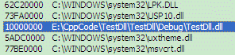
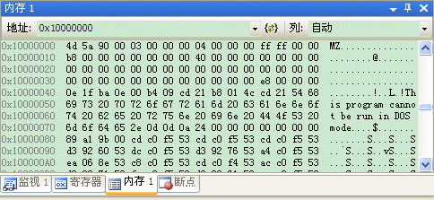
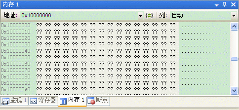

# 一 动态链接库概述

动态链接库是一些独立文件，其中包含能被可执行程序或其他DLL调用来完成某项工作的函数。只有在其他模块调用动态链接库中的函数时，它才发挥作用。

Windwos API中所有的函数都包含在DLL中，其中有3个最重要的DLL。

\* Kernel32.dll - 包含那些用于管理内存、进程和线程的函数，例如**CreateThread**函数

\* User32.dll - 包含那些用于执行用户界面任务（如窗口的创建和消息的传送）的函数，例如CreateWindow函数

\* GDI32.dll - 包含那些用于画图和显示文本的函数。

1 静态库和动态库区别:

2 使用动态库的好处: 共享代码库，减少程序的体积

3 加载动态链接库的方式：隐式和显式

# 二 Win32DLL的创建和使用

需要在每一个将要被导出的函数前面添加标识符：**_declspec（dllexport)**，让DLL导出这些函数。

**可以使用工具Dumpbin或者Depends可以查看DLL文件导出的函数。另外，编译过程会篡改函数名称，这一过程称为”名字粉碎“。因此在使用中常常用exterm "C"进行限制。**

**四 从DLL中导出C++类**

调用方：使用**extern**关键字或者**_declspec(dllimport)**来表明该函数是从动态链接库中引入，一般是被调用方提供给调用方。

**五 解决C++名字粉碎的问题**

**1 使用extern "C"**

希望动态链接库文件在编译时，导出函数的名称不要发生改变。在定义导出函数时，需要加上限定符：**extern "C"。**

该限定符是使用C编译器的设定，C编译器也会对函数名进行改编，具体方法是给函数名添加下划线前缀和一个特殊的后缀，该后缀由一个**@符号**后跟作为参数传给函数的**字节数**组成。

**缺陷：**不能导出一个类的成员函数，只能用于导出全局函数这种情况。

```c
#ifdef __cplusplus
extern "C"{
#endif
    
__declspec(dllexport) int MyAdd(int a,int b);

#ifdef __cplusplus
}
#endif
```

**2 使用def文件**

我们可以告诉编译器不要对导出的函数名进行改编，通过创建一个 .def 文件，并在.def文件中包含以下类型下面的EXPORTS字段。

（1）**EXPORTS**语句后列出要导出函数的名称。可以在.def文件中的导出函数名后加@n，表示要导出函数的序号为n（在进行函数调用时，这个序号将发挥其作用）；

（2）.def 文件中的注释由每个注释行开始处的分号 (**;**) 指定，且注释不能与语句共享一行。

```c
; 注释，用于说明注释导出内容
LIBRARY "你的dll名字"; 注意要跟含导出函数的项目名字一致(不含后缀)
EXPORTS ; 导出关键字，否则提示语句不支持目标平台，dll没有导出函数
funK=funA @2 ;导出函数名为funk，实际调用是funA(起到重命名的作用)
funB @3
funC @4 NONAME ;NONAME表示导出没有名字的函数
```

**（3）使用__declspec(dllexport)和使用.def文件是有区别的。_**

**比较使用_declspec(dllexport)与使用.def文件来导出Dll函数的异同**

相同：创建项目和引用动态库相同

不同：

定义时：.def的要有其文件(LIBRARY EXPORTS),而另外一种则需要在其函数前添加_declspec(dllexport)_

使用时：.def使用函数前要有函数声明，而使用_declspec(dllexport)的要添加头文件

**3 第二种不改变导出函数名的方法(相当于起一个别名)**

如果不想使用.def文件，可以使用第二种方法来导出未经改编的函数名。在DLL的源文件中添加一行类似下面的代码即可：

```c
#pragma comment(linker,"/export:MyAdd=_MyAdd@8")
```

该代码提示链接器，要导出一个名为MyAdd的函数，该函数的入口点与_MyAdd@8相同。当跟使用def文件不同的是，该方法除了导出MyAdd函数外，还有_MyAdd@8。

**六 显式加载方式加载DLL**

通过特定的几个函数在需要使用时进行导入。当采用动态方式加载DLL时，在调用方程序中是不能看到调用该DLL的输入信息。

```c
HMODLE LoadLibrary(LPCTSTR lpFileName); 

HMODULE WINAPI LoadLibraryEx(LPCTSTR lpFileName, _Reserved_ HANDLE hFile, DWORD dwFlags);  
// 将指定的可执行模块映射到调用进程的地址空间,不仅能记载DLL，还可以加载exe(可用于病毒中)。
 
HMODULE GetModuleHandle(PCTSTR pszModule);
// 获取指定模块的载入起始地址
 
FARPROC GetProcAddress(HMODLE hModule, LPCSTR lpProcName);
// 获取导出函数的地址，失败返回NULL，当lpProcName高16位位0时，标识通过标识进行函数查找索引。

BOOL FreeLibrary(HMODULE hLibModule) // 显示卸载DLL模块
    
//在动态库卸载自己(相当于FreeLibrary+ExitThread)
FreeLibraryAndExitThread(g_hDll, 0);
```

// 使用代码例子：

```c
typedef int (_stdcall * AddProc)(int , int );
//定义函数指针类型

HINSTANCE hInst;
hInst = LoadLibrary("test.dll");//动态加载Dll

//获取Dll的导出函数
AddProc fAdd = (AddProc)::GetProcAddress(hInst,"add");
if(fAdd != NULL)
{
    MessageBox("获取Add函数地址失败！");
}
CString stradd;
stradd.Format("5+3=%d",fAdd(5,3));
MessageBox(stradd);
::FreeLibrary(hInst);//释放Dll函数
```

**七 DllMain函数**

对DLL来说，其入口函数是DllMain，但该函数是可选的，也就是说，在编写DLL程序时，可以不提供DllMain函数。如果提供了该函数，当系统加载该DLL时，就会调用该函数。

当动态库正常被载入时，应该返回TRUE，否则返回FALSE。

对于动态链接库来说，获取其自身**模块句柄**的唯一途径就是在入口函数被调用时保存这个参数。

**DisableThreadLibraryCalls**禁用DLL_THREAD_ATTACH和DLL_THREAD_DETACH通知的dll的模块句柄。

```c
BOOL WINAPI DllMain(HINSTANCE hinstDLL,   // DLL模块句柄
                    DWORD fdwReason,   // 系统调用该函数的原因
                    LPVOID lpReserved )  // 保留字段
{
    switch( fdwReason ) 
    { 
        case DLL_PROCESS_ATTACH:        // DLL被载入时触发
            DisableThreadLibraryCalls(hInstDll);    // 禁用DLL_THREAD_ATTACH和DLL_THREAD_DETACH通知
            break;   
            
        case DLL_THREAD_ATTACH: break;    // 动态库中创建子线程时被触发
        case DLL_THREAD_DETACH: break;    // 动态库中创建的线程结束时触发
        case DLL_PROCESS_DETACH:break; // DLL模块被卸载时触发
    }
    return TRUE; // Successful DLL_PROCESS_ATTACH.
}
```

**1.3 发布动态链接库**

Link.exe在生成dll文件的同时也生成导入库文件，如果dll作为最终应用程序的一部分发布，可以仅发布dll文件；如果是当作组件供其他人做二次开发，那么需要同时提供dll文件和lib文件，并且根据具体情况提供不同语言支持的头文件。

**八 注入动态链接库**

```c
//1，在目标进程分配线程函数的参数空间大小                 
p=VirtualAllocEx(hkernel32,NULL,strlen(pname),MEM_COMMIT,PAGE_READWRITE);
//2，把参数写到目标进程分配的空间中
char *pname = "注入DLL文件路径";
bool bb = WriteProcessMemory(hkernel32,p,pname,strlen(pname),NULL);
//3，获取LoadLiabray函数的地址，作为新线程的线程函数调用                
pfn=GetProcAddress(GetModuleHandle("kernel32.dll"),"LoadLibraryA");
//在目标空间创建新线程，线程函数地址是pfn，函数的参数地址是p
HANDLE th = CreateRemoteThread( hkernel32,NULL,0,(LPTHREAD_START_ROUTINE)pfn,p,NULL,0);
```

**动态库卸载自身：FreeLibraryAndExitThread** 

今天的问题是：有没有可能让一个 DLL 自己卸载自己？这个问题可以分成两个部分：

1. 卸载一个 DLL。
2. 卸载 DLL 的代码应该是放在 DLL之中的。

当然，如果不考虑后果的话，这个代码并不难写，如下：

```c
#include <Windows.h>    
HMODULE g_hDll = NULL;  
DWORD WINAPI UnloadProc(PVOID param)  // 卸载
{  
    MessageBox(NULL, TEXT("Press ok to unload me."),  
        TEXT("MsgBox in dll"), MB_OK);  
    FreeLibrary(g_hDll);  
    // oops!  
    return 0;  
}
 
BOOL WINAPI DllMain(HINSTANCE hinstDLL, DWORD fdwReason, PVOID lpvReserved)  
{  
    if (DLL_PROCESS_ATTACH == fdwReason)  
    {  
        g_hDll = (HMODULE)hinstDLL;  
        HANDLE hThread = CreateThread(NULL, 0, UnloadProc, NULL, 0, NULL);  
        CloseHandle(hThread);  
    }  
    return TRUE;  
}
```

简单说明一下：在 DllMain 初始化的时候保存 DLL 的实例句柄（即模块句柄）供 FreeLibrary 调用，然后开启一个线程，在适当的时机调用 FreeLibrary 销毁 DLL。

但是，如果实际运行起来的话，我们会遇到一个很实际的问题：

在 FreeLibrary 之后，该 DLL 的地址空间就不再可用了，但这时 EIP 指针仍然会指向 FreeLibrary 的下面一句，于是程序崩溃。

所幸，Win32 提供了另外的一个 API-----**FreeLibraryAndExitThread**，这个函数能够在销毁 DLL 之后直接调用 ExitThread，这样一来 EIP 指针就不会指向非法的地址了。

因此，我们只需要把 FreeLibrary 的一句替换为：

```
FreeLibraryAndExitThread(g_hDll, 0);  
```

这样就可以了。

实际测试一下，在 DLL 被加载后，July 的模块视图显示了这个被加载的 DLL。



在内存视图中检查模块句柄指向的内容，证明该 DLL 的确被加载了。



**FreeLibraryAndExitThread** 调用后，再查看该模块句柄指向的内存，该地址已不再可用，销毁成功。



